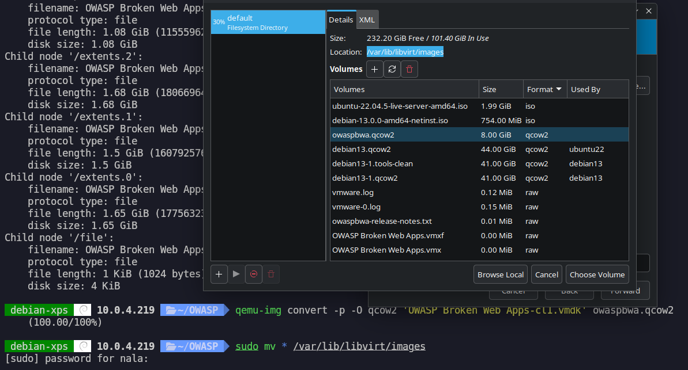
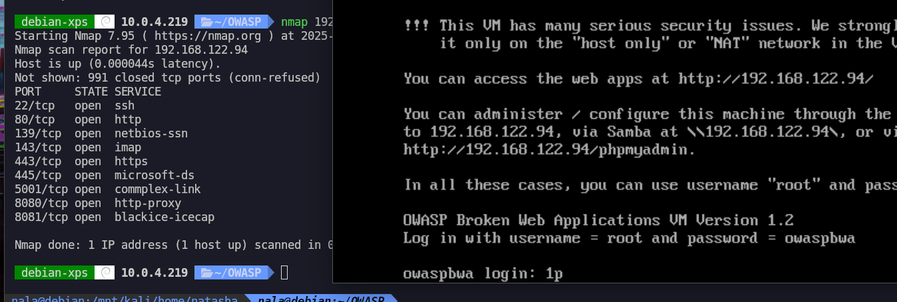
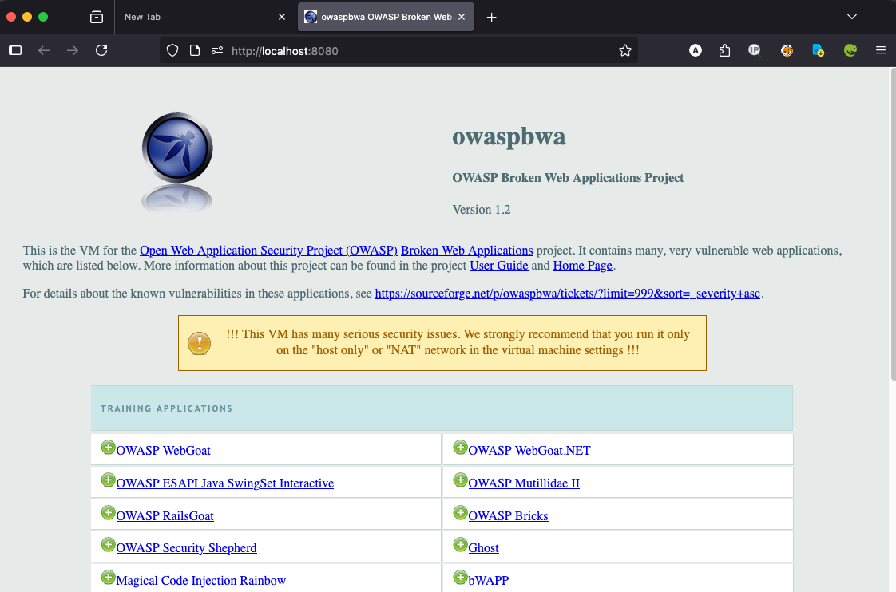

# OWASP Broken Web Applications VM Walkthrough

This walkthrough demonstrates how to set up and configure the OWASP Broken Web Applications VM using QEMU/KVM on a Linux system.

## Prerequisites

- Linux system with QEMU/KVM installed
- libvirt and virt-manager installed
- OWASP Broken Web Apps VM image file
- Sufficient disk space and RAM

## Step 1: Convert VMDK to QCOW2

First, navigate to your OWASP directory and check the original VM image information:

```bash
cd OWASP
qemu-img info 'OWASP Broken Web Apps-cl1.vmdk'
```

Convert the VMDK file to QCOW2 format for better performance with QEMU/KVM:

```bash
qemu-img convert -p -O qcow2 'OWASP Broken Web Apps-cl1.vmdk' owaspbwa.qcow2
```

Move the converted image to the libvirt images directory:

```bash
sudo mv * /var/lib/libvirt/images
```

## Step 2: Create VM in Virtual Manager

After moving the images, you can:

1. Open Virtual Manager (virt-manager)
2. Create a new VM by importing the existing disk image
3. Select `owaspbwa.qcow2` as the disk image
4. Configure VM settings as needed



## Step 3: Network Configuration and Testing

After starting the VM, you can check the connection using nmap. Initially, the VM will get a default network configuration:



Test the connection to the VM:

```bash
nmap 192.168.122.94
```

## Step 4: Configure Isolated Network

For security purposes, change the VM's network from the default to an isolated network. The new IP address will be `192.168.100.183`.

Set up an environment variable for easy script execution:

```bash
export IP="192.168.100.183"
```

This variable can be used in subsequent commands and scripts for easier management.

## Step 5: Access the Web Portal

### Local Access

If you're working locally on the same machine as the VM, you can access the OWASP web portal directly:

```
http://192.168.100.183
```

### Remote Access

If you're accessing remotely, create an SSH tunnel from your local machine through the host to the VM:

```bash
# Create tunnel from your machine → xps-debian → 192.168.100.183:80
ssh -N -L 8080:192.168.100.183:80 xps-debian
```

Then navigate to:
```
http://localhost:8080
```



## Step 6: VM Management

### Shutdown the VM

When you're finished with your testing, properly shutdown the VM:

```bash
sudo virsh shutdown owasp
```

## Additional Notes

- The OWASP Broken Web Applications VM contains intentionally vulnerable web applications for security testing and learning
- Always use this VM in an isolated environment
- Never expose this VM to production networks or the internet
- The VM is designed for educational and testing purposes only

## Security Warning

⚠️ **WARNING**: This VM contains intentionally vulnerable applications. Only use in isolated, controlled environments for educational or testing purposes. Never connect to production networks or expose to the internet.

## Useful Commands

Here are some additional useful commands for managing the VM:

```bash
# List all VMs
sudo virsh list --all

# Start VM
sudo virsh start owasp

# Get VM info
sudo virsh dominfo owasp

# Connect to VM console
sudo virsh console owasp
```

## Troubleshooting

- If you encounter permission issues, ensure your user is in the `libvirt` group
- Check VM logs: `sudo journalctl -u libvirtd`
- Verify network configuration: `sudo virsh net-list`
- Check VM status: `sudo virsh domstate owasp`
